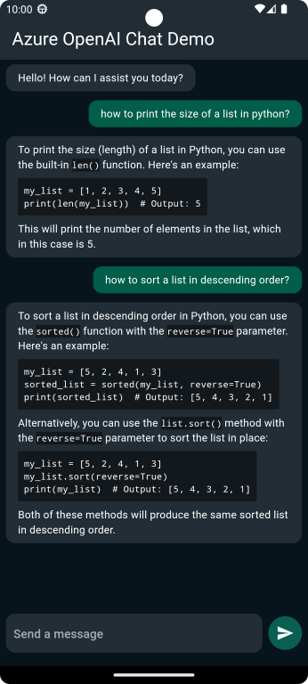

# ChatGPT Clone with Azure, OpenAI, and Flutter

This project is a partial clone of ChatGPT, built using Azure, OpenAI, and the Flutter framework, as described in
the [comprehensive article](https://alexandre-lipp.medium.com/chatgpt-clone-with-flutter-and-azure-openai-95b4aa908f3f) that accompanies this codebase. The goal is to create an intelligent chatbot capable of engaging in dynamic
conversations with users, powered by cutting-edge AI technologies.

## Preview

## Getting Started

In order to run the application successfully, please follow these steps:

1. Create an `api_keys.dart` file in the `src` directory, as detailed in the [accompanying article](https://alexandre-lipp.medium.com/chatgpt-clone-with-flutter-and-azure-openai-95b4aa908f3f). Ensure that you securely store your
   API keys and other sensitive information.

2. Clone or download this repository to your local machine.

3. Set up a Flutter development environment if you haven't already.

4. Run the application on your local environment and start exploring the chatbot capabilities.

## Features

- Create an AI-powered chatbot using Azure, OpenAI, and Flutter.
- Dynamically render chat messages using a `ListView.builder` for performance with long conversations.
- Implement a responsive text input section with loading indicators.
- Customize the assistant's responses using parameters like temperature.
- Save and reference previous conversations for future use.

## Further Improvements

- Implement HTTP streaming to progressively display the assistant's response.
- Explore additional model customization using OpenAI's parameters to fine-tune behavior.
- Add the ability to save and retrieve conversation histories for enhanced user experience.

## Contributing

We welcome contributions and suggestions. Feel free to create pull requests or open issues.

## License

This project is licensed under the **MIT License**
